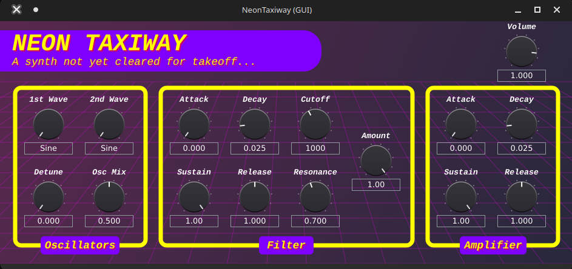

# Neon Taxiway

A synth not yet cleared for takeoff...


## Overview

Neon Taxiway is a simple two-oscillator synthesizer developed as a project for the "Development of Technologies for Music Production" course at the University of Milan.
The synth was built using the [JUCE framework](https://github.com/juce-framework/JUCE) (v 8.0.6). As a starting point, I referenced [this synth](https://github.com/Kuig/DemoSynth).

## Features

### Oscillators

- 2 Oscillators with selectable waveforms:
  - Sine
  - Sawtooth
  - Square
  - Triangle

- Detune control (especially effective when both use the sawtooth waveform)
- Mix control

### Filter

Low-pass filter with:
- Cutoff (20 Hz - 20 KHz)
- Resonance
- Envelope amount
- Dedicated ADSR envelope for filter modulation

### Amplifier
- Independent ADSR envelope for amplitude shaping
- Master volume control

## Installation

This synth was developed on Linux, but also works on Windows. 
To install:
- Clone this repository: ``` git clone https://github.com/MichaelDipilato/Neon-taxiway-synth.git ```
- Open ```NeonTaxiway.jucer``` using the Projucer app
- Export to your preferred IDE (e.g., Visual Studio, Xcode)
- Compile and run

## Future improvements

- Remove aliasing from oscillators
- Add an LFO
- Add a "magic" button that applies an effect (chorus maybe?) 
- Publish a release here on GitHub

## License

This project is licensed under the GNU General Public License v3.0.

You are free to use, modify, and distribute this software under the terms of the GPL-3.0 license.  
See the [LICENSE](LICENSE) file for full details.

